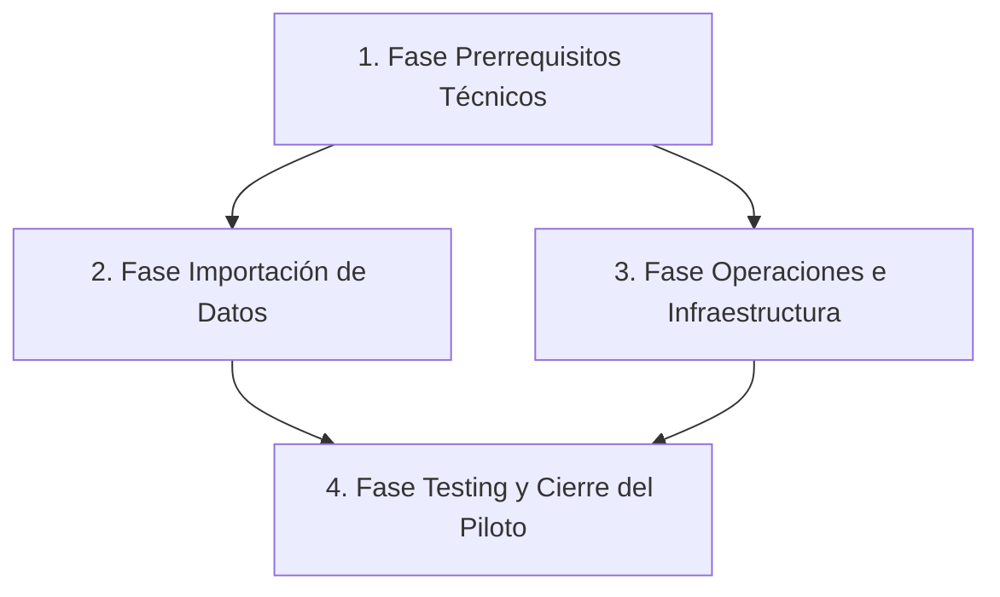

# Plan de Ejecución Orquestado: Piloto UAT

> **Objetivo:** Implementar los bloqueantes técnicos, infraestructura y preparación de datos necesarios para el Piloto UAT, utilizando subagentes especializados para garantizar calidad y eficiencia.

---

## Metodología General

Para cada fase, se delegará el trabajo a **Subagentes Especializados** que serán orquestados secuencialmente. Este enfoque asegura que cada dominio (Django, Seguridad, Infraestructura) sea tratado por el agente con la experiencia más profunda disponible.

### Agentes Involucrados:

- **`django-specialist`**: Encargado de la lógica transaccional, ORM, manejo de errores y validación de formularios.
- **`django-security`**: Encargado de la configuración de seguridad (`settings.py`), validación de variables de entorno y auditoría de logging.
- **`explore`**: Agente de reconocimiento que localizará código existente, patrones de frontend (toasts, HTMX) y la estructura actual del proyecto.
- **`Task (General)`**: Para tareas multi-paso como la creación de scripts de deploy y la integración de librerías externas.
- **`ui-ux-pro-max`**: Asesoría visual para asegurar que los mensajes de error sean consistentes con el sistema de Toast existente.

### Secuencia de Orquestación:

**Dependencias entre fases**: Las Fases 1, 2 y 3 pueden ser paralelizadas parcialmente, pero la Fase 4 (Cierre) depende del éxito de todas las anteriores.



---

## Fase 1: Prerrequisitos Técnicos (Bloqueantes)

### 1.1 Transaccionalidad en Creación y Edición de Dispositivos

**Agente:** `django-specialist`

**Contexto Entregado:**
- Archivos a modificar: `dispositivos/views.py`.
- Funciones objetivo: `dispositivo_create` y `dispositivo_update`.
- Justificación: Evitar registros a medias si falla un guardado.
- Convención actual: Ya se usa `transaction.atomic` en `TrazabilidadService` (asignación, reasignación, devolución), pero faltaba en la creación/edición inicial del dispositivo.

**Instrucción para el Agente:**
1. Revisa las vistas `dispositivo_create` y `dispositivo_update`.
2. Asegúrate de que toda la lógica dentro del `if form.is_valid():` esté protegida por `@transaction.atomic` o un context manager `with transaction.atomic():`.
3. Devuelve el diff de los cambios y justifica si es necesario envolver solo el `.save()` o todo el flujo de creación de actas posteriores.

### 1.2 Protección de Borrado Seguro (IntegrityError/ProtectedError)

**Agente:** `django-specialist`

**Contexto Entregado:**
- Archivo a modificar: `dispositivos/views.py`.
- Función objetivo: `dispositivo_delete`.
- Componente visual existente: El sistema ya tiene un componente de Toast en `base.html` que se dispara con el evento `show-notification`.
- Justificación: Interceptar borrados que violen dependencias y mostrar un toast en vez de un error 500.

**Instrucción para el Agente:**
1. Envuelve la llamada `dispositivo.delete()` en un bloque `try/except` que capture `ProtectedError` y `IntegrityError`.
2. Si ocurre la excepción, en vez de lanzar un 500, dispara la respuesta HTMX adecuada para mostrar el mensaje de error en el toast existente.
3. Valida que el helper `htmx_trigger_response` de `core/htmx.py` sea el adecuado o proponga uno nuevo si el toast requiere un evento Alpine.js diferente.
4. Modifica la plantilla `dispositivos/partials/dispositivo_confirm_delete.html` para mostrar el mensaje de error si se recibe en el contexto.

### 1.3 Configuración de Logging de Seguridad

**Agente:** `django-security`

**Contexto Entregado:**
- Archivo a modificar: `inventario_jmie/settings.py`.
- Objetivo: Generar el archivo `inventario.log`.
- Justificación: Vital para investigar reportes de "le di al botón y desapareció".

**Instrucción para el Agente:**
1. Configura el diccionario `LOGGING` en `settings.py`.
2. Crea un handler que escriba en un archivo `inventario.log` rotativo (o simple si es piloto).
3. Asegura que los loggers de `django.security`, `django.request` y los propios de la app (`dispositivos`, `actas`, `colaboradores`) apunten a este handler.
4. Considera el nivel de severidad: `WARNING` y `ERROR` como mínimo.
5. Verifica que el archivo sea escribible en el entorno de despliegue (Linux VPS) y no exponga información sensible (como contraseñas o `SECRET_KEY`).

### 1.4 Validación de Variables Críticas (Fail-Fast)

**Agente:** `django-security`

**Contexto Entregado:**
- Archivo a modificar: `inventario_jmie/settings.py`.
- Justificación: Si falta `SECRET_KEY` o `ALLOWED_HOSTS`, la app no debe arrancar vulnerable.

**Instrucción para el Agente:**
1. Implementa validaciones que lancen `django.core.exceptions.ImproperlyConfigured` si `SECRET_KEY` o `ALLOWED_HOSTS` no están definidos o son valores por defecto inseguros (ej. `SECRET_KEY = 'change-me'`).
2. Asegura que estas validaciones se ejecuten al importar `settings`, deteniendo el arranque de forma inmediata.

### 1.5 Validador de RUT Chileno

**Agente:** `django-specialist`

**Contexto Entregado:**
- Archivo a crear/modificar: `core/utils.py` y `colaboradores/forms.py`.
- Justificación: Dado que se emitirán actas en PDF, los RUTs deben ser válidos comercialmente.

**Instrucción para el Agente:**
1. Investiga (o implementa) un validador de RUT chileno robusto (algoritmo Módulo 11).
2. Coloca la función/validador en `core/utils.py` para que sea reutilizable.
3. Intégralo en el formulario de `Colaborador` (o el modelo si es posible) para validar tanto el formato (ej. `12345678-9`) como la lógica matemática.
4. Asegura que el mensaje de error del validador sea claro para el usuario final.

---

## Fase 2: Importación de Datos (SharePoint / Excel)

**Agente:** `explore` (para reconocimiento) + `django-specialist` (para adaptación).

**Contexto Entregado:**
- El usuario ya dispone de scripts o lógica previa para importar archivos Excel/CSV desde SharePoint.
- Archivos sospechosos: `core/management/commands/import_devices.py` y `core/management/commands/load_entra_users.py`.

**Instrucción para los Agentes:**
1. **Agente `explore`:** Localiza y documenta la lógica existente de importación. Verifica si usa `pandas`, `openpyxl`, `csv` o `django-import-export`.
2. **Agente `django-specialist`:**
   - Revisa si los scripts existentes están alineados con los modelos actuales (Dispositivo, Colaborador).
   - Si los modelos han cambiado, actualiza los scripts.
   - Asegura que la importación de datos críticos (como asignaciones) esté envuelta en `transaction.atomic` para evitar datos inconsistentes.
   - Propone un comando unificado (ej. `python manage.py seed_piloto_uat`) o valida los comandos actuales.

---

## Fase 3: Operaciones e Infraestructura (Deployment)

**Agente:** `Task (General)`

### 3.1 Script de Respaldo Automático

**Instrucción para el Agente:**
1. Crea el directorio `ops/` si no existe.
2. Crea el archivo `ops/backup_sqlite.sh`.
3. El script debe:
   - Generar un timestamp.
   - Comprimir `db.sqlite3` y la carpeta `media/` en un archivo `.tar.gz`.
   - Guardarlo en un directorio configurable (por defecto `/var/backups/inventario/`).
   - Manejar errores básicos (si la base de datos no existe, notificar).
4. Proporciona el comando `cron` sugerido para ejecutarlo cada 12 horas.

### 3.2 Archivos de Configuración para Servidor

**Instrucción para el Agente:**
1. Crea la carpeta `ops/deploy/`.
2. Genera los siguientes archivos de ejemplo:
   - `gunicorn_inventario.service`: Unidad de Systemd para Gunicorn.
   - `nginx_inventario.conf`: Bloque de servidor Nginx optimizado para servir estáticos, media, proxy_pass a Gunicorn y timeouts.
3. Crea un `README_DEPLOY.md` con:
   - Pre-requisitos del servidor (Ubuntu/Debian).
   - Pasos de instalación (apt-get).
   - Comandos para habilitar y arrancar los servicios (`systemctl`).
   - Sugerencia de uso de Certbot para SSL.

---

## Fase 4: Testing y Cierre del Piloto

**Agente:** `playwright-best-practices` (si es necesario) o `django-verification`.

### 4.1 Verificación de Prerrequisitos

**Instrucción para el Agente:**
1. Ejecuta `pytest` para verificar que los cambios en `dispositivos/views.py` no rompan tests existentes.
2. Si el plan incluye tests E2E, verifica que el flujo de creación, edición y borrado de un dispositivo se comporte correctamente con las nuevas transacciones.

### 4.2 Documentación Final

**Agente:** OpenCode (Coordinador).

**Instrucción:**
1. Generar un reporte resumido de todos los cambios aplicados.
2. Validar que el `AGENTS.md` no requiera actualización.
3. Actualizar el `README_DEPLOY.md` si surgieron cambios durante la implementación.

---

## Flujo de Orquestación Detallado

```text
1. [OpenCode] Inicia la sesión y define el plan.
2. [OpenCode] Lanza al agente `explore` para mapear el estado actual de las importaciones y confirmar los helpers HTMX disponibles.
3. [OpenCode] Lanza al agente `django-specialist` con la tarea de implementar la transaccionalidad y el validador de RUT.
4. [OpenCode] Lanza al agente `django-security` en paralelo para configurar el logging y la validación de entorno.
5. [OpenCode] Revisa los resultados de los agentes `explore` y `django-specialist` para decidir si se adaptan los scripts de importación existentes.
6. [OpenCode] Lanza al agente `Task (General)` para crear los scripts de deploy (`ops/`).
7. [OpenCode] Lanza al agente `django-verification` para ejecutar el test suite final.
8. [OpenCode] Recopila todos los resultados, actualiza la documentación y presenta el resumen al usuario.
```
