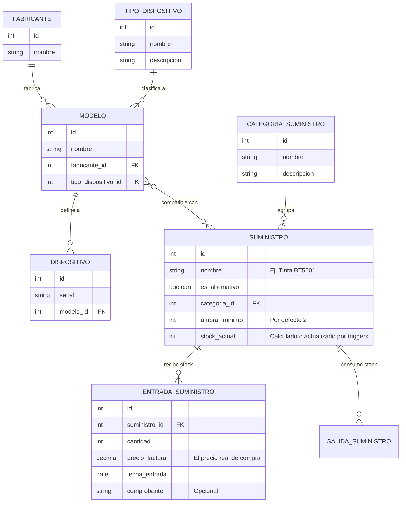

# Diagramas Entidad-Relación: Inventario de Dispositivos y Suministros

A continuación, presento el diagrama de la arquitectura final consensuada. Como mencionaste que borrarás la base de datos para empezar de cero, podemos diseñar la estructura ideal sin preocuparnos por migraciones complejas de datos heredados.

## Arquitectura Final: Dispositivos y Suministros

En este diseño:
1. El `TIPO_DISPOSITIVO` pertenece al `MODELO`, asegurando cero redundancias.
2. Los `SUMINISTROS` se organizan por categorías (con descripción) y soportan entradas de inventario para registrar el precio de factura.
3. Un `SUMINISTRO` puede ser compatible con múltiples `MODELOS`.

### Análisis de los Cambios Acordados:

1. **Borrado y Base Limpia:** Al borrar la BD, simplemente modificamos los modelos de Django (`TipoDispositivo` se mueve a `Modelo`) y hacemos `makemigrations` y `migrate` desde cero. Esto nos da un sistema limpio y escalable.
2. **Suministros y Categorías:** `CategoriaSuministro` tiene ahora su `descripcion`.
3. **Precio de Factura:** El precio ya no vive fijo en el `Suministro`, sino que se registra en cada `ENTRADA_SUMINISTRO` (recepción). Así puedes saber a cuánto compraste la tinta hoy vs. hace un mes.
4. **Múltiples Compatibilidades:** Un suministro (como la tinta BT5001) se relaciona con múltiples modelos de impresoras a través de una relación de Muchos a Muchos (`ManyToManyField`). Además, agregamos el flag `es_alternativo` para diferenciar originales de genéricos.
5. **Nombre del Modelo en el Admin:** Para evitar que salga "Brother Brother MFC..." en la lista de compatibles, ajustaremos el método `__str__` del Modelo en Django, o usaremos un formato más limpio para la UI de suministros.
6. **Filtros Inteligentes (HTMX):** Implementaremos dropdowns dependientes. Si seleccionas la categoría "Tinta de Impresora" al crear un suministro, el selector de Modelos Compatibles solo te mostrará modelos cuyo `tipo_dispositivo` sea "Impresora". No tocaremos la lógica de los otros dispositivos, solo los filtros de la UI para Suministros.
